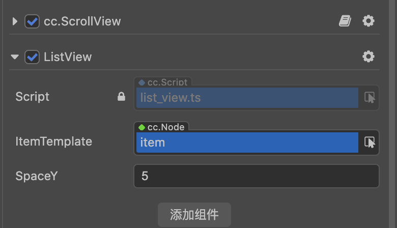

# listview-for-creator3d

100行代码实现 mini 版循环列表

---

### 使用步骤

1. 下载并导入资源包
2. 在 `ScrollView` 节点上挂载 `ListView` 组件
3. 连接 `ItemTemplate`
4. 设置 `SpaceY`

> 推荐在 `ScrollView` 的 Content 里放一个 Item 模板  
> Content 不需要挂 Layout

---
当前为mini版，暂不支持

- 横向
- 多个 Item 模板类型，变高
- 上下左右 Padding
- FillOrder
